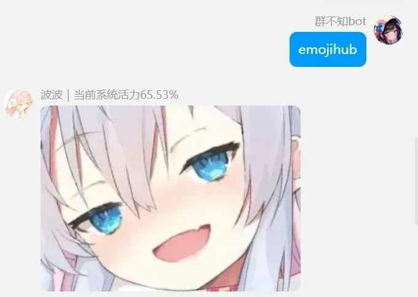
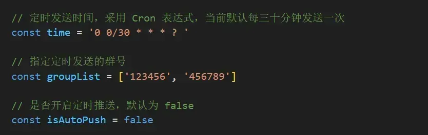
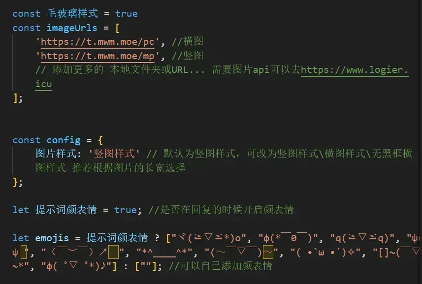

<div style="text-align:center">
    <a href="https://www.logier.icu">
        
    </a>
</div>


<br>
<br>

# 1.emojihub（表情包）

```
curl -o "./plugins/example/emojihub.js" "https://gitee.com/logier/emojihub/raw/main/emojihub.js"
```


发送表情包支持capoo、狗妈、黑白、龙图、柴郡、小黑子
发送capoo即可


推荐把仓库的emojihub文件下载并放到resources文件夹内，会检测是否有本地图片，没有会发送网络图片 

发送emojihub可以发送从emojihub文件夹 内随机一张图片 



你可以把你的表情包文件夹放到emojihub文件夹下，不屏蔽就会一起随机读
默认屏蔽龙图

如果你们有更多表情包欢迎提供！


支持自定义图片


将路径改为你的图库的路径


<br>
<br>

# 2.定时发图

```
curl -o "./plugins/example/定时发图.js" "https://gitee.com/logier/emojihub/raw/main/定时发图.js"
```





需要设置这两部分，效果如下


<br>
<br>

# 3.图片一言

```
curl -o "./plugins/example/maxim.js" "https://gitee.com/logier/emojihub/raw/main/maxim.js"
```

发送带有图片的一言、人间、毒鸡汤、舔狗日记、社会语录、骚话、发病、烧脑、疯狂星期四


需要的设置如下图



图片支持本地文件夹和网络图片api
如果没有图片可以去https://www.logier.icu

<br>
<br>

# 4.今日运势

```
curl -o "./plugins/example/今日运势.js" "https://gitee.com/logier/emojihub/raw/main/今日运势.js"
```

[借鉴自暮佬的jryspro，原项目地址](https://github.com/Twiyin0/koishi-plugin-jryspro)

可定时发送，直接发送指令为#今日运势


<br>
<br>

# 5.算一卦

```
curl -o "./plugins/example/算一卦.js" "https://gitee.com/logier/emojihub/raw/main/算一卦.js"
```

可定时发送，直接发送指令为#算一卦


<br>

### 如果有更多文案或者图片api欢迎推荐给我