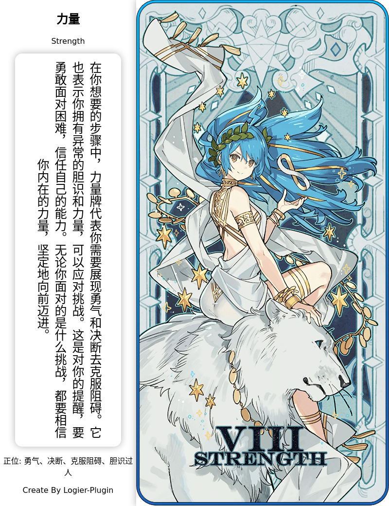

# logeier-plugin

云崽js插件合集

<!-- PROJECT SHIELDS -->

[![Contributors][contributors-shield]][contributors-url]
[![Forks][forks-shield]][forks-url]
[![Stargazers][stars-shield]][stars-url]
[![Issues][issues-shield]][issues-url]
[![MIT License][license-shield]][license-url]
[![LinkedIn][linkedin-shield]][linkedin-url]

<!-- PROJECT LOGO -->
<br />

<p align="center">
  <a href="https://www.logier.icu/">
    
  </a>

 
## 目录

- [注意](#注意)
- [表情包系列](#表情包系列)
    - [表情包仓库](#表情包仓库)
    - [表情包小偷](#表情包小偷)
    - [戳一戳表情包](#戳一戳表情包)
- [定时系列](#定时系列)
    - [定时发图](#定时发图)
    - [资讯推送](#资讯推送)
- [运势系列](#运势系列)
    - [今日运势](#今日运势)
    - [算一卦](#算一卦)
    - [塔罗牌](#塔罗牌)
- [小修系列](#小修系列)
    - [今日老婆](#今日老婆)
    - [进退群通知](#进退群通知)
    - [todo](#todo)
- [使用到的框架](#使用到的框架)
- [如何参与开源项目](#如何参与开源项目)
- [作者](#作者)
- [版权说明](#版权说明)
- [鸣谢](#鸣谢)

### 注意

 *仓库内含有大量文本，例如今日运势的抽签内容、算一卦的卦象和塔罗牌解析等，可能被标记可疑内容，可以直接在仓库内压缩下载。*

 *如果出现任何bug或者想要新功能，希望及时提交issue或者qq联系我。*


### 表情包系列

#### 一、表情包仓库

1. 发送指令就回复表情包。
2. 仓库自带龙图、七濑胡桃、atri、chiikawa、小狐狸、小黑子、狗妈、柴郡、capoo、甘城猫猫、真寻酱、阿夸、白圣女、阿尼亚等表情包。
3. 支持自定义本地或网络表情包。
```
├── emojihub
│   ├── capoo-emoji
│   │   ├── capoo100.gif
│   ├── greyscale-emoji
│   │   ├── greyscale100.gif
如果文件结构是这样的，可以填写emojihub或capoo-emoji
```

<br>

#### 二、表情包小偷

1. 群友发送表情包自动记录。
2. 群友发送消息时概率发送记录下的表情包。
3. 未经过严格及大量测试，如果有问题可以在本仓库提交issue或者去Q群联系我。

<br>

#### 三、戳一戳表情包（未做完）

1. 戳一戳向gpt发送消息并回复。
2. 戳一戳回复图片接入本仓库表情包

<br>

### 定时系列

#### 一、定时发图

1. 定时发送图片，支持本地和网络图片。
2. 本地图片支持图片文件上两级目录
```
├── emojihub
│   ├── capoo-emoji
│   │   ├── capoo100.gif
│   ├── greyscale-emoji
│   │   ├── greyscale100.gif
如果文件结构是这样的，可以填写emojihub或capoo-emoji
```

<br>

#### 二、资讯推送

1. 支持发送摸鱼日历、每天60s新闻和城市天气
2. 上述三种资讯都可以定时定群推送
3. 城市天气是图片渲染后发送，样式如下


<br>

### 运势系列


#### 一、今日运势

1. 发送今日运势即可
2. 一天可以悔签一次


<br>

#### 二、算一卦

1. 发送算一卦即可使用
2. 一天可以悔卦一次


<br>

#### 三、塔罗牌

* 占卜内容由ai发送 

1. 发送塔罗牌+想占卜的东西即可



2. 支持抽三张占卜，发送 占卜+想占卜的东西 即可。
3. 注意三牌占卜会用合并转发形式发送，部分适配器可能不支持。

<br>

### 小修系列

#### 一、今日老婆

1. 重复发送marry会看到今天娶了谁。
2. 使用图片形式发送，带有一句结婚祝词。
3. 可以离婚（
4. 离婚一天只能一次。
5. 想用相合伞渲染，让两个人的名字在伞下两边，但找不到好的相合伞素材（


<br>

#### 二、进退群通知

1. 修改自官方插件。
2. 进群时会发送其头像和一句 俏皮话欢迎。
3. 退群时有必要说俏皮话吗？


<br>

#### 三、todo

1. 图片一言（maxim）重做

<br>

### 使用到的框架

- [Miao-Yunzai v3](https://gitee.com/yoimiya-kokomi/Miao-Yunzai)


### 如何参与开源项目

贡献使开源社区成为一个学习、激励和创造的绝佳场所。你所作的任何贡献都是**非常感谢**的。


1. 欢迎在issue或者q群提醒我插件bug
2. 丰富表情包仓库


### 作者

logier

qq:785189653  
qq群:315239849


### 版权说明

该项目签署了MIT 授权许可，详情请参阅 [LICENSE](https://github.com/logier/logier-plugin/blob/master/LICENSE)

### 鸣谢

- [jryspro](https://github.com/twiyin0/koishi-plugin-jryspro)
- [一些基础插件示例~](https://gitee.com/Zyy955/Miao-Yunzai-plugin)


