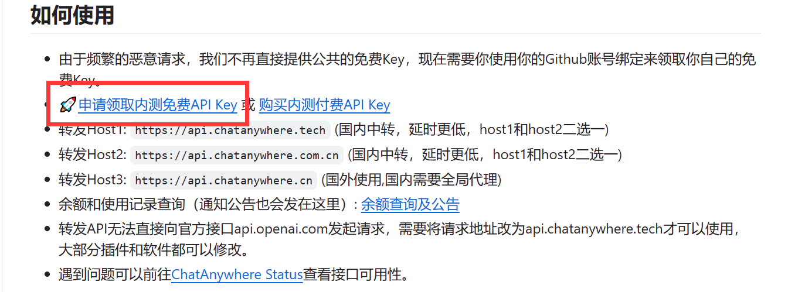

# logeier-plugin

云崽js插件合集

<a href='https://gitee.com/logier/logier-plugin/stargazers'></img></a> 
<a href='https://gitee.com/logier/logier-plugin/members'></img></a>
<a href="https://qm.qq.com/cgi-bin/qm/qr?k=Tx0KJBxwamQ1slXC4d3ZVhSigQ9MiCmJ&jump_from=webapi&authKey=BJVVNjuciQCnetGahh3pNOirLULs1XA7fQMn/LlPWAWk5GDdr2WWB/zHim1k1OoY">
<a href="https://logier.gitee.io">


<br />

<p align="center">
  <a href="https://www.logier.icu/">
    
  </a>


 
## 目录

- [注意事项](#注意事项)
    - [如何填入本地图库？](#如何填入本地图库)
    - [如何获取key？](#如何获取key)
    - [如何获取图片api？](#如何获取图片api)
- [表情包系列](#表情包系列)
    - [表情包仓库](#表情包仓库)
    - [表情包小偷](#表情包小偷)
    - [戳一戳表情包](#戳一戳表情包)
- [定时系列](#定时系列)
    - [定时发图](#定时发图)
    - [资讯推送](#资讯推送)
- [运势系列](#运势系列)
    - [今日运势](#今日运势)
    - [算一卦](#算一卦)
    - [塔罗牌](#塔罗牌)
- [小修系列](#小修系列)
    - [今日老婆](#今日老婆)
    - [进退群通知](#进退群通知)
- [TODO](#TODO)

 <br>


## 注意事项


 *如果出现任何bug或者想要新功能，希望及时提交issue或者qq联系我。*


 ### 如何填入本地图库？

使用图片时，均可以使用本地或者网络图片
本地图片支持图片文件上两级目录，也就是如果文件结构如下，可以填写emojihub或capoo-emoji
```
├── emojihub
│   ├── capoo-emoji
│   │   ├── capoo100.gif
│   ├── greyscale-emoji
│   │   ├── greyscale100.gif
支持webp、jpeg、webp、webp、gif
```


### 如何获取key？

塔罗牌可以前往[chatanywhere](https://github.com/chatanywhere/GPT_API_free?tab=readme-ov-file#%E5%A6%82%E4%BD%95%E4%BD%BF%E7%94%A8)免费获得。

<details> <summary>还是不懂？</summary>


1.点击领取内测免费API Key




<br>

2.复制这一串东西填入


</details>

<br>
<br>

城市天气可以前往[和风天气](https://console.qweather.com/#/apps)免费获得

还是不懂？👉[和风天气官方教程](https://dev.qweather.com/docs/configuration/project-and-key/)


插件加载后，可以在/resources/logier/key.json修改对应的key，之后就无需再在插件内填入
<details> <summary>key.json预览</summary>
将xxx替换为你的key即刻

</details>


### 如何获取图片api？

[我的个人博客](https://logier.gitee.io/gallery/)有很多我收集的图片api

<details> <summary>图片api预览</summary>

</details>

<br>

## 表情包系列


### 表情包仓库

```
curl -o "./plugins/example/表情包仓库.js" "https://gitee.com/logier/logier-plugin/raw/master/%E8%A1%A8%E6%83%85%E5%8C%85%E4%BB%93%E5%BA%93.js"
```

- 发送指令就回复表情包。
- 仓库自带龙图、七濑胡桃、atri、chiikawa、小狐狸、小黑子、狗妈、柴郡、capoo、甘城猫猫、真寻酱、阿夸、白圣女、阿尼亚等表情包。
- 支持自定义本地或网络表情包。[如何填入本地图库？](#如何填入本地图库)


### 表情包小偷

```
curl -o "./plugins/example/表情包小偷.js" "https://gitee.com/logier/logier-plugin/raw/master/%E8%A1%A8%E6%83%85%E5%8C%85%E5%B0%8F%E5%81%B7.js"
```

- 群友发送表情包自动记录。
- 群友发送消息时概率发送记录下的表情包。
- 未经过严格及大量测试，如果有问题可以在本仓库提交issue或者去Q群联系我。


### 戳一戳表情包（未做完）

- 戳一戳向gpt发送消息并回复。
- 戳一戳回复图片接入本仓库表情包

<br>


## 定时系列


### 定时发图

```
curl -o "./plugins/example/定时发图.js" "https://gitee.com/logier/logier-plugin/raw/master/%E5%AE%9A%E6%97%B6%E5%8F%91%E5%9B%BE.js"
```

- 定时发送图片，支持本地和网络图片。
- 支持本地图片和网络图片。

[如何填入本地图库？](#如何填入本地图库)

[如何获取图片api？](#如何获取图片api)

<details> <summary>定时发图预览</summary>

</details>


### 资讯推送

```
curl -o "./plugins/example/资讯推送（60s新闻、摸鱼日历、天气）.js" "https://gitee.com/logier/logier-plugin/raw/master/%E8%B5%84%E8%AE%AF%E6%8E%A8%E9%80%81%EF%BC%8860s%E6%96%B0%E9%97%BB%E3%80%81%E6%91%B8%E9%B1%BC%E6%97%A5%E5%8E%86%E3%80%81%E5%A4%A9%E6%B0%94%EF%BC%89.js"
```

- 支持发送摸鱼日历、每天60s新闻和城市天气
- 上述三种资讯都可以定时定群推送
- 城市天气需要从和风天气获取key [如何获取key？](#如何获取key)
- 城市天气是图片渲染后发送，样式如下

<details> <summary>天气预览</summary>

</details>

<br>


## 运势系列


### 今日运势

```
curl -o "./plugins/example/今日运势.js" "https://gitee.com/logier/logier-plugin/raw/master/%E4%BB%8A%E6%97%A5%E8%BF%90%E5%8A%BF.js"
```


- 发送今日运势即可
- 一天可以悔签一次

[如何获取图片api？](#如何获取图片api)

<details> <summary>今日运势预览</summary>

</details>


### 算一卦

```
curl -o "./plugins/example/算一卦.js" "https://gitee.com/logier/logier-plugin/raw/master/%E7%AE%97%E4%B8%80%E5%8D%A6.js"
```

- 发送算一卦即可使用
- 一天可以悔卦一次

[如何获取图片api？](#如何获取图片api)

<details> <summary>算一卦预览</summary>

</details>


### 塔罗牌

```
curl -o "./plugins/example/塔罗牌.js" "https://gitee.com/logier/logier-plugin/raw/master/%E5%A1%94%E7%BD%97%E7%89%8C.js"
```

* 由AI解析占卜，需要gptkey [如何获取key？](#如何获取key)

- 发送塔罗牌+想占卜的东西即可

<details> <summary>塔罗牌预览</summary>

</details>

- 支持抽三张占卜，发送 占卜+想占卜的东西 即可。
- 注意！三牌占卜会用合并转发形式发送，部分适配器可能不支持。

<details> <summary>占卜预览</summary>

</details>

<br>


## 小修系列


### 今日老婆

```
curl -o "./plugins/example/今日老婆.js" "https://gitee.com/logier/logier-plugin/raw/master/%E4%BB%8A%E6%97%A5%E8%80%81%E5%A9%86.js"
```

- 重复发送marry会看到今天娶了谁。
- 使用图片形式发送，带有一句结婚祝词。
- 可以离婚（
- 离婚一天只能一次。
- 想用相合伞渲染，让两个人的名字在伞下两边，但找不到好的相合伞素材（

<details> <summary>今日老婆预览</summary>

</details>


### 进退群通知

```
curl -o "./plugins/example/进退退群通知.js" "https://gitee.com/logier/logier-plugin/raw/master/%E8%BF%9B%E7%BE%A4%E9%80%80%E7%BE%A4%E9%80%9A%E7%9F%A5.jss"
```

- 修改自官方插件。
- 进群时会发送其头像和一句 俏皮话欢迎。
- 退群时有必要说俏皮话吗？

<details> <summary>进退群预览</summary>

</details>

<br>

## TODO


1. 图片一言（maxim）重做
2. 问候回复接入gpt

<br>


## 使用到的框架


- [Miao-Yunzai v3](https://gitee.com/yoimiya-kokomi/Miao-Yunzai)
- [icqq](https://github.com/icqqjs/icqq)
- [emojihub](https://gitee.com/logier/emojihub)

<br>

## 作者


logier

- qq群：[315239849](https://qm.qq.com/cgi-bin/qm/qr?k=Tx0KJBxwamQ1slXC4d3ZVhSigQ9MiCmJ&jump_from=webapi&authKey=BJVVNjuciQCnetGahh3pNOirLULs1XA7fQMn/LlPWAWk5GDdr2WWB/zHim1k1OoY)

- 个人网站：[logier.icu](https://logier.gitee.io)

<br>

## 版权说明


该项目签署了MIT 授权许可，详情请参阅 [LICENSE](https://github.com/logier/logier-plugin/blob/master/LICENSE)

<br>

## 鸣谢


- [jryspro](https://github.com/twiyin0/koishi-plugin-jryspro)
- [一些基础插件示例~](https://gitee.com/Zyy955/Miao-Yunzai-plugin)
- [Yunzai-Bot 相关内容索引](https://gitee.com/yhArcadia/Yunzai-Bot-plugins-indexn)


